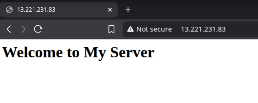

# Automated Server Setup

A Bash script to automate Nginx web server setup on Ubuntu.

## Pre-requisites

- Ubuntu 20.04 or above
- Root privileges
- Internet connection
- AWS EC2 instance with port 80 open (HTTP)

## Setup

1. Clone the repository:

    ```bash
    git clone https://github.com/Chetan3500/server-setup.git
    cd server-setup
    ```

2. Make te script executable.

    ```bash
    chmod +x setup_server.sh
    ```

3. Run the script:

    ```bash
    sudo ./setup_server.sh
    ```

4. Access the server at `http://<your-ec2-public-ip>`.

## Features

- Updates system packages
- Install and configures Nginx
- Create a basic webpage (`/var/www/html/index.html`)
- Ensures Nginx is running
- Check internet connectivity before setup

## Screenshots




