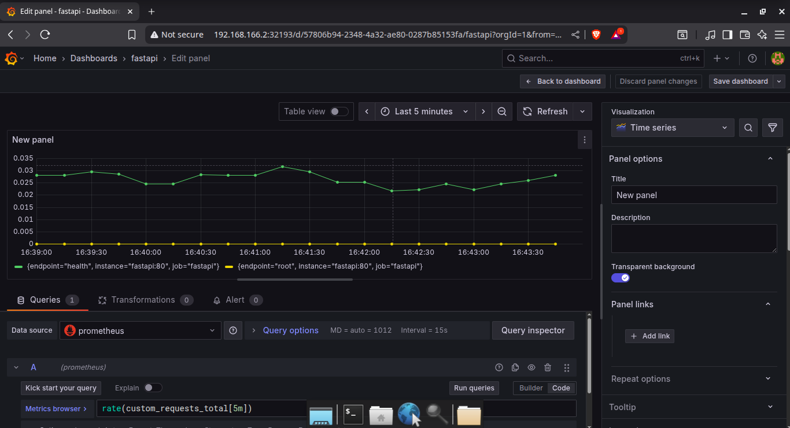

# DevOps Automation Portfolio

A project showcasing DevOps skills with Linux, Bash, Git, Docker, FastAPI, GitHub Actions, Prometheus, Grafana, and Kubernetes on Ubuntu.

## Phase 1: Automated Nginx Setup
- **Script**: `setup_server.sh`
- **Output**: `nginx_test.txt`, `screenshot.png`
- **Features**: Installs Nginx, creates webpage, logs setup.

## Phase 2: Containerized FastAPI Application
- **Files**: `main.py`, `Dockerfile`, `requirements.txt`, `docker_fastapi*.txt`, `fastapi_screenshot.png`
- **Features**: FastAPI app with /, /health, /info endpoints, containerized.

## Phase 3: CI/CD and Monitoring
- **Files**: `test_main.py`, `ci.yml`, `prometheus_*.txt`, `custom_*.txt`, `prometheus_screenshot.png`
- **Features**: GitHub Actions CI/CD, Prometheus monitoring.

## Phase 4: Orchestration and Scaling
- **Files**: `docker-compose.yml`, `nginx.conf`, `project4_*.txt`, `nginx_screenshot.png`
- **Features**: Docker Compose with Nginx load balancing, Prometheus monitoring.

## Phase 5: Kubernetes and Advanced Monitoring
Production-like deployment with Kubernetes, Nginx, Prometheus, and Grafana.

### Prerequisites
- Ubuntu (local or AWS EC2)
- Docker, Minikube v1.34.0, kubectl v1.31.1, Python 3, FastAPI, Nginx, Prometheus, Grafana v11.2.0
- Ports 80, 9090, 3000 open

### Setup Instructions
1. Clone:
   ```bash
   git clone https://github.com/Chetan3500/server-setup
   cd server-setup
   ```
2. Start Minikube:
   ```bash
   minikube start --driver=docker
   ```
3. Deploy:
   ```bash
   kubectl apply -f fastapi-deployment.yaml
   kubectl apply -f fastapi-service.yaml
   kubectl apply -f nginx-deployment.yaml
   kubectl apply -f nginx-configmap.yaml
   kubectl apply -f nginx-service.yaml
   kubectl apply -f prometheus-configmap.yaml
   kubectl apply -f prometheus-deployment.yaml
   kubectl apply -f prometheus-service.yaml
   kubectl apply -f grafana-deployment.yaml
   kubectl apply -f grafana-service.yaml
   ```
4. Access:
   - FastAPI: `xdg-open $(minikube service nginx --url)`
   - Prometheus: `xdeg-open $(minikube service prometheus --url)`
   - Grafana: `xdeg-open $(minikube service grafana --url)` (login: admin/admin)


### CI/CD

- **Workflow**: `.github/workflows/ci.yml`.
- Tests, builds Docker image, validates Kubernetes manifests.


### Monitoring
- Prometheus scrapes `/metrics` (e.g., `custom_requests_total`).
- Grafana visualizes metrics in “FastAPI Metrics” dashboard.

### FastAPI endpoints

- `get /` - welcome message
- `get /heatlth` - health check
- `get /info` - server info

### Files

- `main.py` - FastAPI app with logging
- `Dockerfile` - Docker configuration
- `requirements.txt` - Python dependencies
- `docker_fastapi*.txt` - Test outputs
- `fastapi_*.png` - Screenshot of API response
- `test_main.py`: Pytest tests
- `prometheus_ui.txt`, `prometheus_query.txt`, `custom_metrics.txt`, `custom_query.txt`: Monitoring outputs
- `prometheus_screenshot.png`: Prometheus UI
- `deploy_fastapi.txt`: Deployment output
- `docker-compose.yml`, `nginx.conf`, `prometheus.yml`: Orchestration configs
- `project4_*.txt`: Deployment and monitoring outputs
- `nginx_screenshot.png`: Load balancer response
- `*-deployment.yaml`, `*-service.yaml`, `*-configmap.yaml`: Kubernetes manifests
- `project5_*.txt`: Deployment and monitoring outputs
- `project5_grafana_screenshot.png`: Grafana dashboard

### Screenshots

- Nginx:

    

- FastAPI:
    
    - `GET /`

    
    
    - `GET /health`
    
    
    
    - `GET /INFO
    
    

- Prometheus:

    

- Load Balancer:

    

- Grafana:

    
